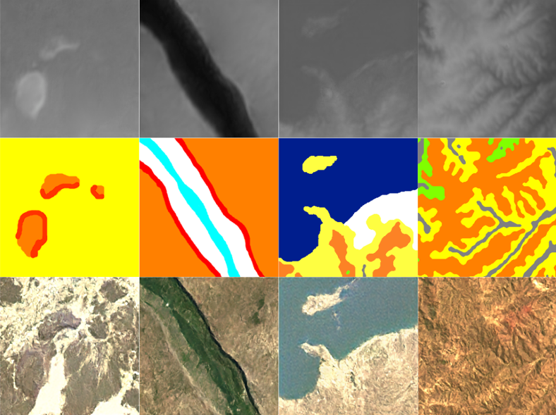

# Terrain Generation With LDMs
<!-- 
[**High-Resolution Image Synthesis with Latent Diffusion Models**](https://ommer-lab.com/research/latent-diffusion-models/)<br/>
[Robin Rombach](https://github.com/rromb)\*,
[Andreas Blattmann](https://github.com/ablattmann)\*,
[Dominik Lorenz](https://github.com/qp-qp)\,
[Patrick Esser](https://github.com/pesser),
[Björn Ommer](https://hci.iwr.uni-heidelberg.de/Staff/bommer)<br/>
_[CVPR '22 Oral](https://openaccess.thecvf.com/content/CVPR2022/html/Rombach_High-Resolution_Image_Synthesis_With_Latent_Diffusion_Models_CVPR_2022_paper.html) |
[GitHub](https://github.com/CompVis/latent-diffusion) | [arXiv](https://arxiv.org/abs/2112.10752) | [Project page](https://ommer-lab.com/research/latent-diffusion-models/)_ -->


<!--  -->
This [Stable Diffusion](https://github.com/CompVis/stable-diffusion/tree/main) fork was used to train Latent Diffusion Models for the simultaneous generation of terrain heightmaps and textures. This was achieved by training the model on a dataset of heightmap-surface image pairs.


<p align="center">
  
</p>

*Figure 1: Terrain heightmaps and their corresponding textures generated by a semantic synthesis model.*


## Dataset

The dataset used for training - texture and heightmap RGBA images - can be found [here](https://github.com/maggieNeedsZzz/textured-terrain-dataset.git).


## Setup

An example config file is shown in ``configs/terrain/terrain-ldm-kl-4-rgba.yaml``. This file needs to be completed with the path to a pre-trained autoencoder checkpoint. Training also requires a [conda](https://conda.io/) environment, that can be created with: 
```
conda env create -f environment.yaml
```


Then, training can be conducted by enabling the ``ldm`` env with:
```
conda activate ldm
```
And running:
```
python main.py --base configs/terrain/terrain-ldm-kl-4-rgba.yaml -t --gpus 0
```

<!-- 
#### Reference Sampling Script

We provide a reference sampling script, which incorporates

- a [Safety Checker Module](https://github.com/CompVis/stable-diffusion/pull/36),
  to reduce the probability of explicit outputs,
- an [invisible watermarking](https://github.com/ShieldMnt/invisible-watermark)
  of the outputs, to help viewers [identify the images as machine-generated](scripts/tests/test_watermark.py).

After [obtaining the `stable-diffusion-v1-*-original` weights](#weights), link them
```
mkdir -p models/ldm/stable-diffusion-v1/
ln -s <path/to/model.ckpt> models/ldm/stable-diffusion-v1/model.ckpt 
```
and sample with
```
python scripts/txt2img.py --prompt "a photograph of an astronaut riding a horse" --plms 
```

By default, this uses a guidance scale of `--scale 7.5`, [Katherine Crowson's implementation](https://github.com/CompVis/latent-diffusion/pull/51) of the [PLMS](https://arxiv.org/abs/2202.09778) sampler, 
and renders images of size 512x512 (which it was trained on) in 50 steps. All supported arguments are listed below (type `python scripts/txt2img.py --help`).


```commandline
usage: txt2img.py [-h] [--prompt [PROMPT]] [--outdir [OUTDIR]] [--skip_grid] [--skip_save] [--ddim_steps DDIM_STEPS] [--plms] [--laion400m] [--fixed_code] [--ddim_eta DDIM_ETA]
                  [--n_iter N_ITER] [--H H] [--W W] [--C C] [--f F] [--n_samples N_SAMPLES] [--n_rows N_ROWS] [--scale SCALE] [--from-file FROM_FILE] [--config CONFIG] [--ckpt CKPT]
                  [--seed SEED] [--precision {full,autocast}]

optional arguments:
  -h, --help            show this help message and exit
  --prompt [PROMPT]     the prompt to render
  --outdir [OUTDIR]     dir to write results to
  --skip_grid           do not save a grid, only individual samples. Helpful when evaluating lots of samples
  --skip_save           do not save individual samples. For speed measurements.
  --ddim_steps DDIM_STEPS
                        number of ddim sampling steps
  --plms                use plms sampling
  --laion400m           uses the LAION400M model
  --fixed_code          if enabled, uses the same starting code across samples
  --ddim_eta DDIM_ETA   ddim eta (eta=0.0 corresponds to deterministic sampling
  --n_iter N_ITER       sample this often
  --H H                 image height, in pixel space
  --W W                 image width, in pixel space
  --C C                 latent channels
  --f F                 downsampling factor
  --n_samples N_SAMPLES
                        how many samples to produce for each given prompt. A.k.a. batch size
  --n_rows N_ROWS       rows in the grid (default: n_samples)
  --scale SCALE         unconditional guidance scale: eps = eps(x, empty) + scale * (eps(x, cond) - eps(x, empty))
  --from-file FROM_FILE
                        if specified, load prompts from this file
  --config CONFIG       path to config which constructs model
  --ckpt CKPT           path to checkpoint of model
  --seed SEED           the seed (for reproducible sampling)
  --precision {full,autocast}
                        evaluate at this precision
```
Note: The inference config for all v1 versions is designed to be used with EMA-only checkpoints. 
For this reason `use_ema=False` is set in the configuration, otherwise the code will try to switch from
non-EMA to EMA weights. If you want to examine the effect of EMA vs no EMA, we provide "full" checkpoints
which contain both types of weights. For these, `use_ema=False` will load and use the non-EMA weights. -->


<!-- 
## BibTeX

```
@misc{rombach2021highresolution,
      title={High-Resolution Image Synthesis with Latent Diffusion Models}, 
      author={Robin Rombach and Andreas Blattmann and Dominik Lorenz and Patrick Esser and Björn Ommer},
      year={2021},
      eprint={2112.10752},
      archivePrefix={arXiv},
      primaryClass={cs.CV}
}
```

 -->
